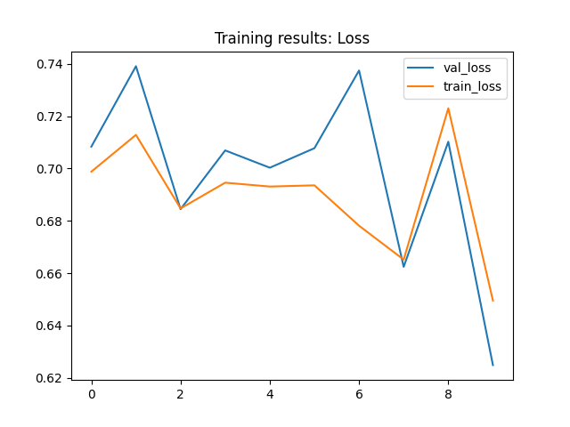
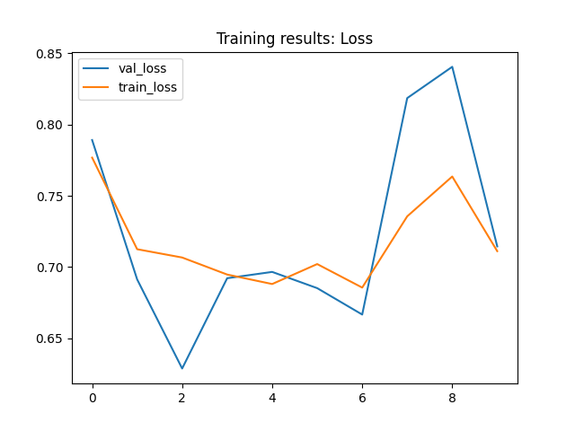

# Problem understanding: Cat vs. Classifier #
In this toy project, I aim to build a deep learning clssifier that predicts whether an image is cat or not. </br>

<!-- 
 -->


  Cat            |  Dog
:--------------:|:--------:
  |  


<!-- <br> -->
Refer to this [link](https://www.kaggle.com/competitions/dogs-vs-cats/data) to get the data.

# Run the project #
In this project, I have two steps: training and predicting. In the predict step, you can upload any image from your laptop and predict it. Let's show you how to run the project.

If you do not have venv package, please refer to this [link](https://linuxize.com/post/how-to-create-python-virtual-environments-on-ubuntu-18-04/)
</br>

## Create virtual environment ##

```
$ python3 -m venv ENV_NAME
```
## Activate your environment ##

```
$ source ENV_NAME/bin/activate
```

## Requirement installations ##
To run this, make sure to install all the requirements by:

```
$ pip install -r requirements.txt 
```
# Training the model #

```
$ python3 main.py --model MODEL_NAME --num_epochs
```
## Example of running models ##

```
$ python3 main.py --model resnet --10
```

```
$ python3 main.py --model cnn --10
```

# Results Presentation

``` Resnet result```  </br>
 

``` CNN result```  </br>
 

# Make prediction #

```
$python3 predict.py --image_path "./data/Images/cat.0.jpg"
```

``` Example: Result```  </br>
 </br>
{'class': 'cat', 'confidence': '0.5970718264579773'}
---
___

---
___

# Related Papers #

* <a href= 'https://arxiv.org/pdf/1512.03385.pdf'> Resnet </a>
* <a href= 'https://cs.nju.edu.cn/wujx/paper/CNN.pdf'> Convolutional neural networks</a>


    
